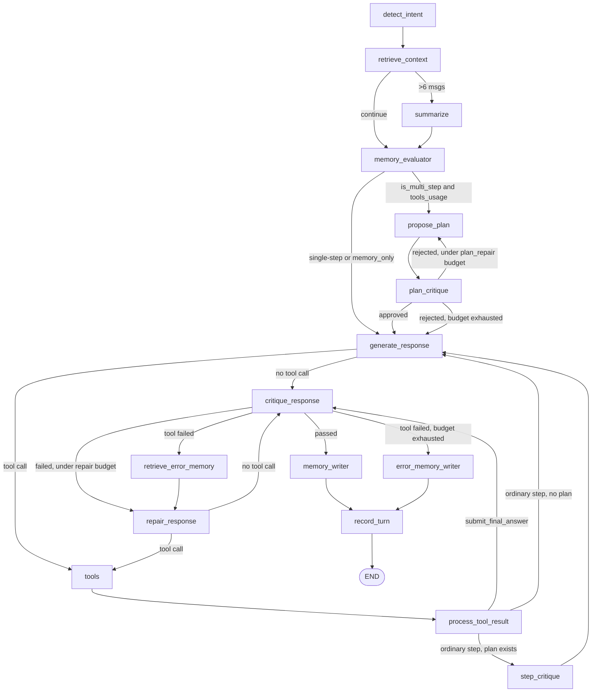

# Smart Home LangGraph Workflow Diagram

## Memory Evaluator Node

The **memory_evaluator** node decides whether memory is sufficient to answer the user's question, and whether the question needs a multi-step plan:

- **`memory_usage_mode = memory_only`**: Memory contains the answer → `generate_response` and `repair_response` run **without tools bound** (LLM physically cannot call analysis tools)
- **`memory_usage_mode = partial`**: Memory contains some facts → tools are available for missing facts, and the response combines memory with tool results
- **`memory_usage_mode = none`**: Computation is needed → tools are available for the full analysis
- **`is_multi_step`**: True when the question requires several dependent calculation steps (a later step needs an earlier step's result) — routes through the plan/plan-critique loop before any code executes. Single-step questions skip planning entirely.

This prevents redundant tool calls when the answer already exists in long-term memory, and prevents multi-step questions from starting execution on an unreviewed approach.

## Plan Proposal & Critique

For multi-step questions only:

- **`propose_plan`** asks the LLM to describe the dependent steps needed to answer the question, without writing any code.
- **`plan_critique`** reviews the plan's approach (completeness, step ordering, specificity) before any execution starts.
- If rejected, `propose_plan` retries with the critique's hints, bounded by `max_plan_repairs`. If the budget is exhausted, execution proceeds anyway (fail open) — the final critique/repair loop remains the backstop.
- The approved plan is included in the tool-enabled prompt so `generate_response` executes it step by step.

## Step Critique (mid-loop)

For multi-step questions, every ordinary tool result (not the final `submit_final_answer`) is checked by **`step_critique`** against the plan before looping back to `generate_response`:

- If the step passed, or the step's retry budget (`max_step_repairs`) is exhausted, execution continues silently.
- If the step failed under budget, the critique's hints are surfaced in the next tool-enabled prompt so the model redoes that step before continuing.
- `step_critique` always routes back to `generate_response` — it never blocks the loop or ends the run.
- This uses its own `step_repair_count` / `max_step_repairs`, completely separate from the final layer's `repair_count` / `max_repairs`, so a bad step can't consume the final answer's repair budget (and vice versa).

## Notes

- Entry point: `detect_intent`.
- Memory evaluator gates tool access based on memory sufficiency, and gates planning based on `is_multi_step`.
- Only multi-step, tool-using questions go through `propose_plan` / `plan_critique` / `step_critique`. Single-step and memory-only questions use the original direct path.
- Direct answers and explicit `submit_final_answer` results go to `critique_response`.
- Ordinary tool results loop back to `generate_response` — through `step_critique` when a plan exists, or directly when it doesn't.
- The critique-repair loop exits to `memory_writer` on pass or max repair exhaustion.
- If tool failure persists at max repairs, flow writes to `error_memory_writer` before ending.
