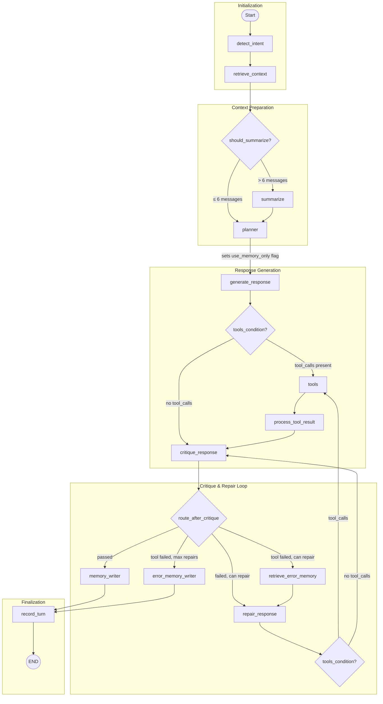

# Smart Home LangGraph Workflow Diagram

## Planner Node

The **planner** node decides whether memory is sufficient to answer the user's question:

- **`use_memory_only = true`**: Memory contains the answer → `generate_response` and `repair_response` run **without tools bound** (LLM physically cannot call `python_repl`)
- **`use_memory_only = false`**: Computation needed → `generate_response` and `repair_response` run **with tools bound** (LLM can call `python_repl`)

This prevents redundant tool calls when the answer already exists in long-term memory.

## Notes

- Entry point: `detect_intent`.
- Planner gates tool access based on memory sufficiency.
- Tool execution is optional and controlled by `tools_condition`.
- Critique-repair loop exits to `memory_writer` on pass or max repair exhaustion.
- If tool failure persists at max repairs, flow writes to `error_memory_writer` before ending.
