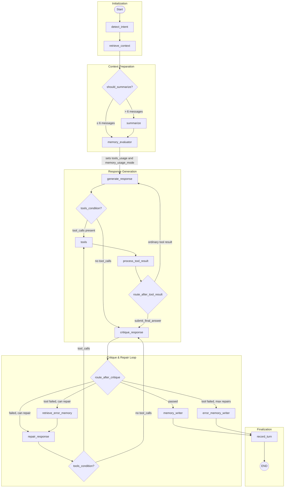

# Smart Home LangGraph Workflow Diagram

## Memory Evaluator Node

The **memory_evaluator** node decides whether memory is sufficient to answer the user's question:

- **`memory_usage_mode = memory_only`**: Memory contains the answer → `generate_response` and `repair_response` run **without tools bound** (LLM physically cannot call analysis tools)
- **`memory_usage_mode = partial`**: Memory contains some facts → tools are available for missing facts, and the response combines memory with tool results
- **`memory_usage_mode = none`**: Computation is needed → tools are available for the full analysis

This prevents redundant tool calls when the answer already exists in long-term memory.

## Notes

- Entry point: `detect_intent`.
- Memory evaluator gates tool access based on memory sufficiency.
- Direct answers and explicit `submit_final_answer` results go to `critique_response`.
- Ordinary tool results loop back to `generate_response` so multi-step analysis can continue before critique.
- The critique-repair loop exits to `memory_writer` on pass or max repair exhaustion.
- If tool failure persists at max repairs, flow writes to `error_memory_writer` before ending.
