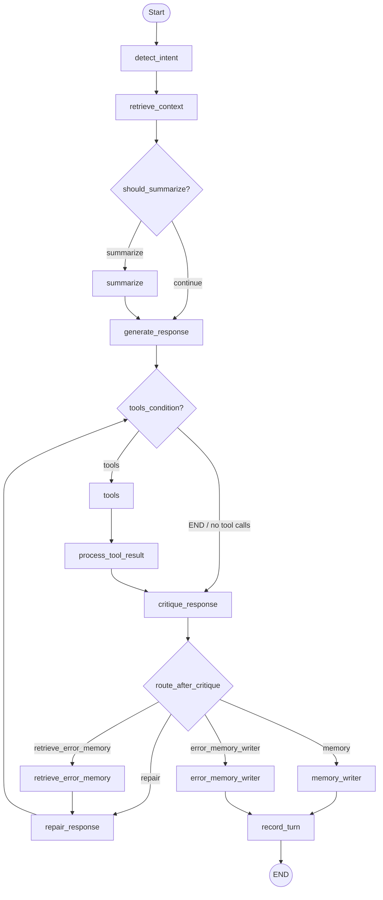

# Smart Home LangGraph Workflow Diagram

## Notes

- Entry point: `detect_intent`.
- Tool execution is optional and controlled by `tools_condition`.
- Critique-repair loop exits to `memory_writer` on pass or max repair exhaustion.
- If tool failure persists at max repairs, flow writes to `error_memory_writer` before ending.
