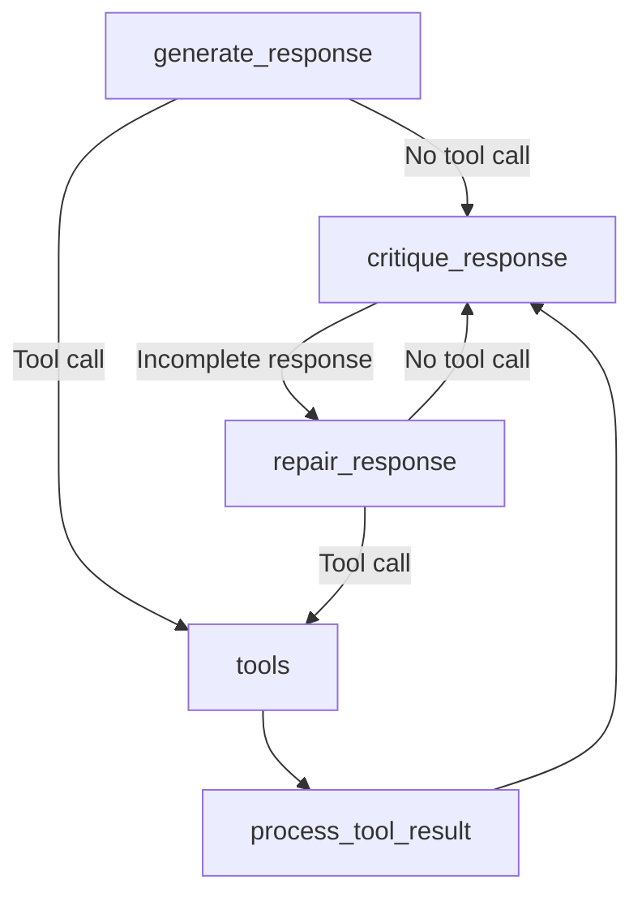
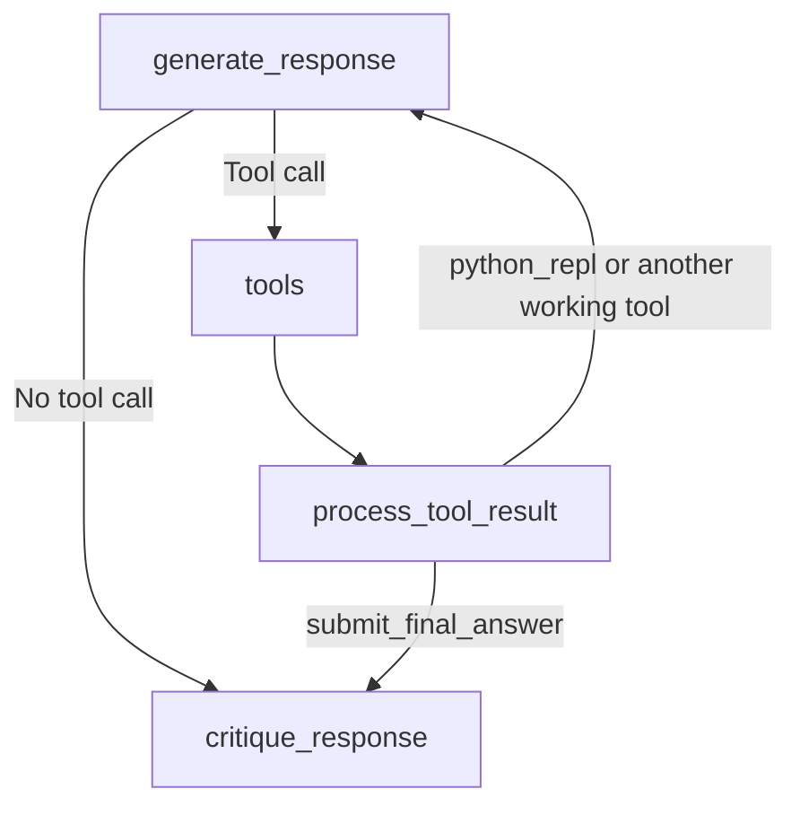
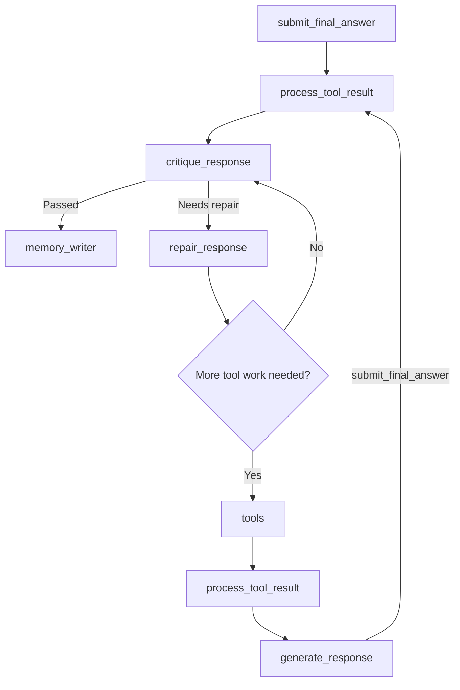
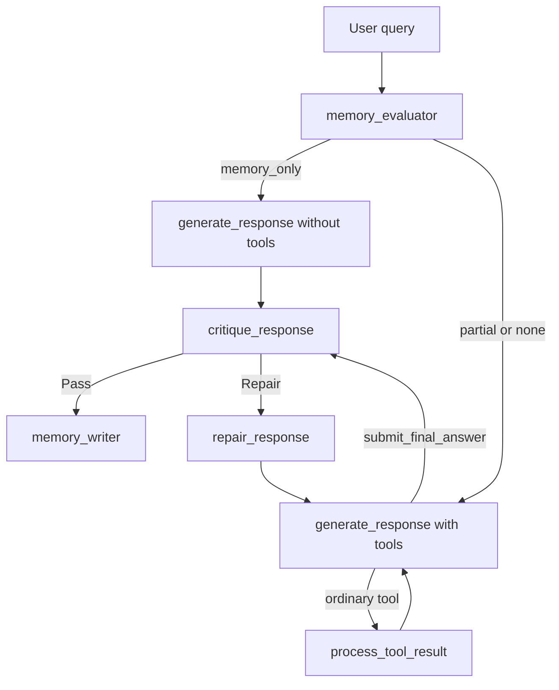

# Workflow Issue and Solution

## Issue

For multi-step questions, the response node may need several tool calls. For example, it may first inspect the dataset, then calculate totals, then calculate percentages.

The original workflow sent every tool result directly to the critique node:



This caused a problem:

1. `generate_response` called a tool for an exploratory step.
2. The tool executed successfully.
3. `process_tool_result` sent the partial result directly to `critique_response`.
4. Critique correctly detected that the complete question had not been answered.
5. Critique sent the state to `repair_response`.
6. Repair had to continue the analysis after the response node had already stopped too early.

The system could eventually recover, but the critique and repair loop was being used to continue normal analysis. This added latency and made the workflow less clear.

## Solution

The workflow now distinguishes between an ordinary analysis tool and an explicit completion tool:

- An ordinary tool, such as `python_repl`, means the agent is still working.
- `submit_final_answer` means the agent believes the complete answer is ready for review.

The new workflow is:



For a multi-step data-analysis question, the normal path is now:

```text
generate_response
    -> python_repl
    -> process_tool_result
    -> generate_response
    -> python_repl
    -> process_tool_result
    -> generate_response
    -> submit_final_answer
    -> process_tool_result
    -> critique_response
```

The response node is not an internal loop. LangGraph calls the node again after each ordinary tool result, while preserving the messages and tool outputs in the workflow state.

## Completion Tool

The completion tool accepts the final answer and returns it through the existing `response` state field:

```python
submit_final_answer(answer="The complete answer...")
```

There is no separate `answer` field in `AgentState`. The `response` field remains the single source of truth for:

- critique,
- repair,
- memory writing,
- final output.

## Critique and Repair Loop

Critique is still required after the agent submits its final answer. It verifies that the answer is correct, complete, and consistent with the available evidence.



The two loops have different responsibilities:

- **Analysis loop:** `generate_response -> tools -> process_tool_result -> generate_response`
  - Continues normal multi-step investigation.
- **Quality loop:** `critique_response -> repair_response -> ... -> critique_response`
  - Corrects an answer that was submitted but failed quality checks.

## Memory Modes

The same workflow supports all memory modes:

- `memory_only`: the response is generated without tools and goes directly to critique.
- `partial`: the response uses known memory facts and calls tools for missing facts, then submits the combined answer.
- `none`: the response uses tools for the required analysis, then submits the answer.



## Result

The workflow no longer treats every successful tool execution as evidence that the answer is ready for critique. The response node can perform as many dependent analysis steps as needed, and critique is called when:

- a memory-only response is generated directly, or
- the tool-enabled agent explicitly calls `submit_final_answer`.

This keeps critique strict while preventing it from handling ordinary intermediate exploration.
